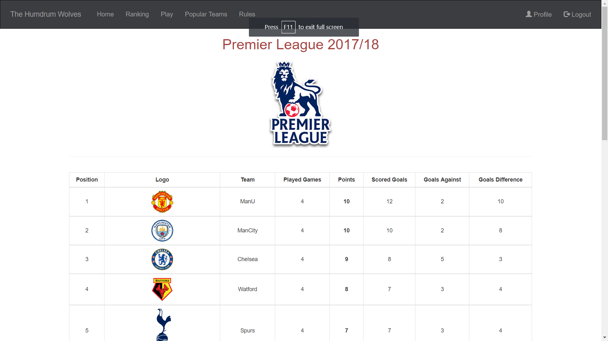
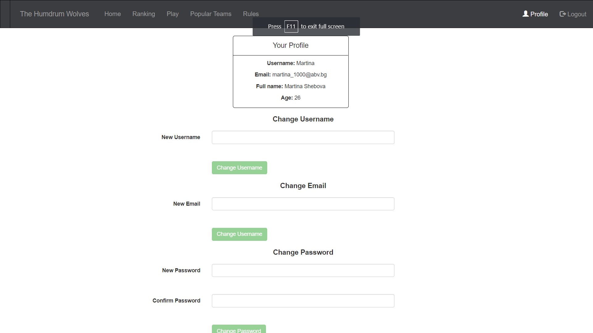

# The Humdrum Wolves

Football Matches Statistics - Angular Course Project

## Getting Started

This application is based on the following technologies:

- Node.js
- Mongo DB
- Angular
- Angular Cli

### Prerequisites

`Console #1`: run "mongod" (assuming that you have installed Mongo on your PC)

`Console #2`: in directory "./server" run command "**node server**"

`Console #3`: in directory "./client" run command "**ng serve**"

### Main functionalities

`Public Part`:

- home team competitions page
- popular competitions page
- login page
- register page

`Private Part`:

- profile page (editable)
- all fixtures page
- single team fixtures page
- team players page
- competitions league table
- rules page
- users ranking page (future feature)

### Routes

`Public`

* /home
* /teams
* /register
* /login

`Private`

* /ranking
* /play
* /team/:id
* /team/:id/players
* /competition/:id
* /profile

## Images

  
   
  
  
  
    
    

## Deployment

## Authors

* **Petar Yerzhabek (http://telerikacademy.com/Users/Xenoleth)**
* **Petar Bochukov (http://telerikacademy.com/Users/Aimanan)**
* **Martina Shebova (http://telerikacademy.com/Users/Martina_Shebova)**

## License

This project is licensed under the MIT License
